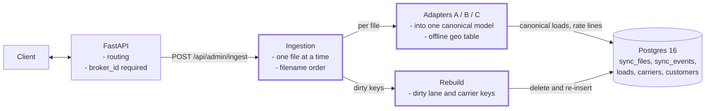
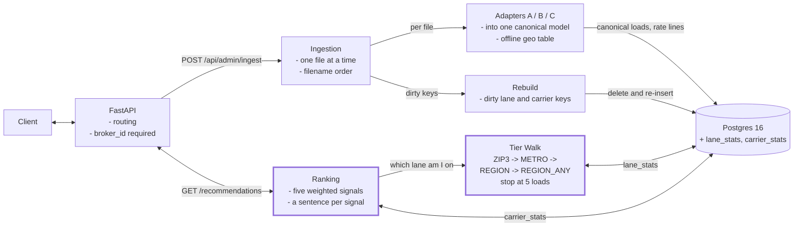
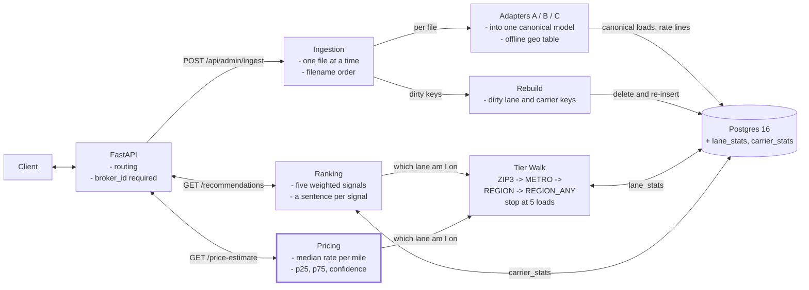
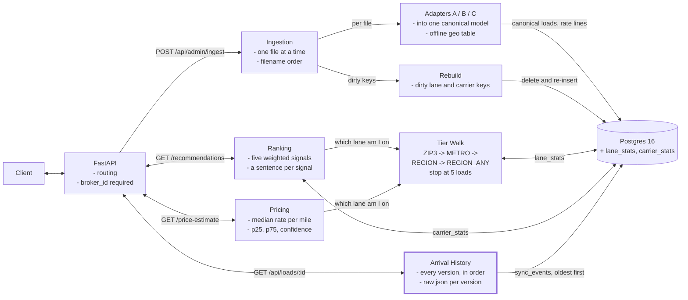
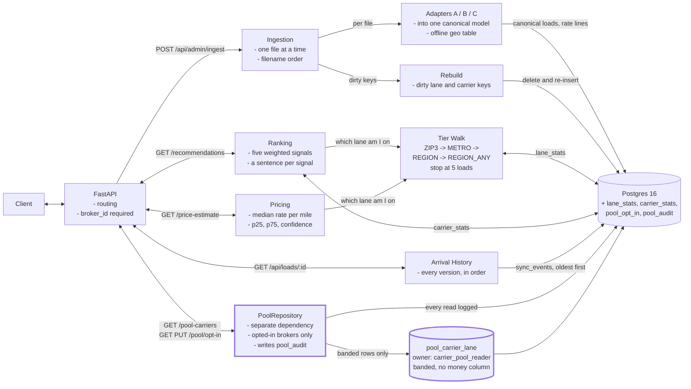

# Carrier Pool: carrier recommendation for freight brokers

Carrier Pool answers two questions about a freight load that has no truck yet. Who do I call, and what do I pay them? Both answers come only from the asking broker's own history, and both show the arithmetic behind them.

---

# The opening

---

After reading `README.md`, here is what it asks for and what I did with it.

The assignment is two questions about a load with no truck. Who do I call first, and why? What should I expect to pay? Both come from the asking broker's own history and both have to show their working. Around them sits the rest: three TMS formats describing the same freight differently, eleven days of synthetic data written as test cases rather than noise, chronological one-file ingestion, and a platform where one broker's data never influences another's answers. The bonus is a carrier pool shared between competitors.

I built all of it, the bonus included: 132 sync files, three adapters into one canonical model, an append-only event log with derived statistics rebuilt from it, the tier walk, ranking, pricing, both screens, and the pool with its boundary enforced by Postgres roles rather than application code. The fixture is 3 brokers, 295 loads, 34 carriers and 1156 sync events over eleven days, with 16 day-11 loads waiting for an answer.

Four things are cut on purpose. No authentication, so the broker comes from a dropdown. No road routing, so distance is offline. No TMS API clients, since the brief says the data is already downloaded. And no k-anonymity in the pool, which at three brokers is arithmetically impossible rather than unimplemented.

Then the conflicts. There were five, and they are where the decisions are.

**The road factor against the mileage check.** The brief fixes distance as straight line times 1.2 and separately states that Dallas to Houston is about 240 miles. With real coordinates those cannot both hold: the great circle is 225.8 miles, so times 1.2 gives 271.0, and I-45 is straight enough that its true factor is nearer 1.06. I kept 1.2 and recorded the 13% overstatement (D10), since bending the factor to hit one pair makes every indirect pair worse.

**Visual polish counting for nothing against the reasoning being the product.** The same brief says polish is not graded and that a bare score is not useful. I read the first as permission to skip design work, not to make the reasoning hard to read. Every ranked carrier shows the sentences that produced its score.

**The shared pool against multi-tenancy being the headline claim.** The brief demands that one broker's data never reach another's answers, then offers a bonus that crosses exactly that line. I built the pool last, so the non-sharing behavior was proven before a sharing boundary was designed around it (D4). The exception is scoped to the ranking, and with everyone opted out the ranking is byte identical to what it was before the pool existed (D17).

**Per-TMS timestamp precision against one honest definition of on time.** TMS A carries a UTC offset, TMS B writes naive Central, TMS C pairs a UTC arrival with a bare local scheduled date. Hour-level on-time is available for some brokers and not others, which would make the phrase mean a different thing per tenant. So it is a date comparison (D7), and TMS C's arrival converts back to Central first, or every delivery after 19:00 local reads a day late (D16).

**Tracing every load end to end against funding the lane statistics.** A broker gets about 132 load appearances and a full lifecycle consumes four to six, so tracing everything yields roughly 30 distinct loads per broker. That will not fund a rich lane, a thin lane and a spread of carrier experience at once (D1). Most history arrives once, already completed, and the multi-appearance budget goes to lifecycle and corrections.

That is the shape of it. Want the system design, or the product?

---

## Functional Requirements

```
1. Ingest a broker's TMS syncs, one file at a time, in chronological order
2. Rank that broker's carriers for a load with no truck, each with the reason it ranked there
3. Estimate what that load should cost, with the evidence behind it
4. Show a correction as a correction
5. Opt in to a shared carrier pool and see carriers this broker has never used


Constraints
- One broker's data never influences another broker's answers
- Every lane and price answer names its tier and its load count
- Every reason is generated from the number that produced the score
- Derived statistics are rebuilt from the append-only log, never patched
```

## Overview

**One** constrains the implementation rather than the output. Chronological single-file ingestion is stated in the brief, so the ordering has to come from somewhere trustworthy, and the only clock all three TMSs share is the one in the filename. One fixture file carries a `lastModifiedDate` earlier than the file before it, so sorting on a field the TMS controls gets the order wrong.

**Two** is the product. A coverage rep ignores `score: 0.87` and acts on "ran this zip3 pair 8 times, most recent three days ago, truck is 11.6 miles from your pickup."

**Three** shares its lane definition with two, which is why they sit next to each other. The same twelve loads that rank the carriers set the price.

**Four** is phrased as a feature rather than an invariant on purpose. A restated rate should reach the broker as an event with a before and an after, not as a number that changed while nobody was looking.

**Five** is the bonus, and the one requirement that argues with the constraints above it.

**The constraints** are things a broker experiences, which is why they sit here rather than under non-functional. How I guarantee them is section 6.

---

## Non-Functional Requirements

```
- Tenant isolation enforced by the database, not by convention
- Ingestion idempotent on (broker_id, sync_file)
- Answers reproducible forever: as_of is the newest ingested file, not now()
- No network at runtime; geography and distance are offline
- Ingest completes before the server accepts a connection
- One machine: one Postgres, one process, one connection per request
```

## Overview

Isolation first, because it is the claim the brief cares most about, and a query that filters by `broker_id` is only as good as the next person to add a query. So the database holds the rule and the application asks permission.

Reproducibility is the one that surprised me. Recency decays with days since a carrier's last load, so a scorer reading `now()` would rot every expected score in the traceability table within a week. Instead `as_of` is `max(synced_at)`, which makes the clock part of the data rather than part of the run.

No network at runtime means geography is a hardcoded table of 180 Texas Triangle places mapping city, state and zip to latitude, longitude, metro and zip3. The fixture generator and the platform read the same table, so "how far is Coppell from Sugar Land" has exactly one answer in this system.

Ingesting all 132 files takes 4.3 seconds inside the FastAPI lifespan, before Uvicorn accepts a connection. Background ingest was the alternative, and its failure mode is wrong answers rather than slow ones.

---

## Core Entities

```
- Broker
- SyncFile
- SyncEvent
- Load
- Carrier
- Customer
- LaneStats
- CarrierStats
```

## Overview

`SyncFile` and `SyncEvent` are the append-only pair: one row per ingested file, one row per entity that file changed. They hold the raw TMS JSON, and every derived number traces back to a row in `SyncEvent`. `Load`, `Carrier` and `Customer` hold current truth, rewritten from the newest event. `LaneStats` and `CarrierStats` are derived and disposable on purpose: a rebuild deletes the affected keys and recomputes them, so no partially patched row ever exists.

One event per load is the obvious grain, and TMS B breaks it twice. A sync can append a rate line for a load whose `loads` array never mentions it, so change detection keyed off that array keeps quoting a stale carrier rate. And a TMS B carrier rate is the sum of every line item ever appended on that side, negatives included, so the money is not a field in any one file. `SyncEvent` therefore has a `RATE_LINE` type carrying its own `source_load_id`.

`CarrierStats` keeps `on_time_eligible_count` beside `on_time_count`, because the denominator is not the load count. A truck still rolling has no verdict, and dividing by `load_count` reads it as a missed delivery.

Opting into the pool is a row in `pool_opt_in` rather than a boolean on `Carrier`. The control that relaxes the boundary is a separate table from the rows it protects.

---

## API Routes

```
// Loads. broker_id is required on every one of these
GET  /api/brokers                               -> Broker[]      the one unbound route
GET  /api/loads?broker_id=&status=              -> Load[]
GET  /api/loads/{id}?broker_id=                 -> LoadDetail    + every version as it arrived

// The two answers
GET  /api/loads/{id}/recommendations?broker_id= -> { tier_walk, carriers[] }
GET  /api/loads/{id}/price-estimate?broker_id=  -> { point, p25, p75, confidence, provenance }

// The pool, deliberately not a field on /recommendations
GET  /api/pool/opt-in?broker_id=                -> { broker_id, opted_in }
PUT  /api/pool/opt-in?broker_id=                -> { broker_id, opted_in }
GET  /api/loads/{id}/pool-carriers?broker_id=   -> PoolSection   banded, no money

// Operations
POST /api/admin/ingest                          -> IngestReport  idempotent replay
GET  /api/health                                -> { status, database, data_dir }
```

## Overview

`broker_id` is required on every load route, and not for convenience. `source_load_id` is unique only within a broker, so two brokers can both hold id `127412794` and mean different freight. Another broker's load comes back as a 404, the same 404 as an id that exists nowhere, because whether an id exists is itself another tenant's data.

The pool is a separate route rather than a field on the recommendations response, which makes the isolation claim checkable. With every broker opted out, the ranking response is byte identical to what it was before the pool existed. The price estimate gains no code path to a pooled number either, because it never calls the pool repository.

`GET /api/loads/{id}` returns every version of the load as it arrived, alongside the raw JSON its TMS stated. That is requirement four expressed as a response body.

One thing I would flag myself: `broker_id` is a query parameter and there is no auth. Demo posture, written down as an accepted risk. In production it comes from a session.

---

## High-Level Design

***Bridge into the drawing:*** *"Let me draw it. I'll build it up one requirement at a time, starting with the part everything else reads from."*

One diagram that grows. Each requirement adds to it, and the new part is what I talk about.

### 1. Ingest each broker's syncs, one file at a time, in order

`POST /api/admin/ingest`, and the same code path runs in the FastAPI lifespan at startup.



```
                    SyncFile              SyncEvent             Load
                    - broker_id           - broker_id           - broker_id
                    - sync_file           - source_load_id      - source_load_id
                    - synced_at           - event_type          - stops[]
                    - unique together     - raw TMS json        - equipment, money
```

## Overview

The adapters hold the domain and most of the real work. Weight converts to pounds, which for TMS C means reading `bos__Weight_Units__c` per line item before summing, because reading tons as pounds understates a load two thousand fold. A missing unit label is pounds, the schema's own default, but an unrecognized one is refused for that item rather than assumed. Equipment maps to four values and a null one stays `UNKNOWN`, with no DEFAULT and a CHECK constraint listing exactly those four. TMS B's naive timestamps are Central with DST applied, so a July time is UTC minus five.

Sorting by filename rests on an assumption worth stating out loud. All three TMSs name files on the same local Central clock while their payloads disagree about time zones entirely. If one vendor started naming files in UTC, the sort would interleave wrongly and nothing in the data would look broken.

An unrecognized location becomes geo-null: excluded from lane statistics, still displayed. Re-ingesting a file is a no-op on `(broker_id, sync_file)`, which is what makes ingest safe to run at every startup.

---

### 2. Rank that broker's carriers, with the reason each ranked where it did

`GET /api/loads/{id}/recommendations?broker_id=`. Day-11 load `127412794`: Coppell TX 75019 to Sugar Land TX 77479, dry van, 296.0 miles, status Booking, no carrier.



```
lane experience  0.35  n/(n+5), n=8             0.615385  ->  21.538
recency          0.20  e^(-3/30), 3 days        0.904837  ->  18.097
equipment        0.15  hauled dry van before    1.000000  ->  15.000
deadhead         0.20  last drop Irving, 11.6mi 1.000000  ->  20.000
on-time          0.10  shrunk toward the lane   0.967949  ->   9.679
                                                              ------
                                                                84.3
```

## Overview

IBRAHIM TRANSPORT INC comes first at 84.3 because it ran 8 of the 12 loads on this lane, the most recent three days ago, and its last drop was Irving, 11.6 miles from the pickup. Second place is 14.6 behind, all of it experience and recency, since both trucks sit in DFW and both haul dry van. The answer a rep would give out loud is the answer the arithmetic gives.

Every carrier the broker has used comes back, weakest last, with the reason it is weak. A rep shown only a top five cannot tell whether the sixth was bad or missing, and that difference decides whether they keep calling.

Reasons are generated, never written independently. One call produces a signal's value, its weighted contribution and its sentence together, and `score` is a derived property of those contributions rather than a stored field, so no field can hold a number the breakdown does not add up to.

Cold start lives in the first two signals. Lane experience is `n/(n+5)`, a saturating count rather than a shrinkage formula, because shrinking toward a mean is right for a rate and wrong for a count: it would let a carrier with zero loads on the lane score like an average one. On-time is a rate, so it does shrink toward the lane mean with `k = 5`. The usual statement of the trap, that 2-for-2 must not beat 164-for-200, is false as written on the on-time signal alone, which reverses once the lane average passes roughly 0.7455. That is shrinkage working rather than a bug, and a veteran at 82% on a lane averaging 92% is genuinely below average. The claim holds on the composite, where on-time hands the rookie at most 1.8 points against the 24.1 that experience hands the veteran.

---

### 3. Estimate what the load should cost, with its evidence

`GET /api/loads/{id}/price-estimate?broker_id=`. Same load, and the customer will pay $628.70. Neither the carrier nor the price exists anywhere in the file.



```
1  ZIP3        750->774,        dry van    12 loads   ACCEPTED
2  METRO       DFW->HOU,        dry van    not asked
3  REGION      TX_TRIANGLE,     dry van    not asked
4  REGION_ANY  TX_TRIANGLE,     no filter  not asked
```

## Overview

Coppell is zip3 750 in metro DFW, Sugar Land is zip3 774 in metro HOU, and both sit in `TX_TRIANGLE`. The walk goes narrow to wide and stops at the first rung holding at least 5 loads. Rung one clears, so rungs two through four are never queried, and the response reports the walk it actually performed rather than a summary of it. Equipment filters at every rung, which is why the fourth exists: a rare equipment type gets an answer instead of nothing, always labeled low confidence.

This walk answers the brief's hardest definitional question, which is what counts as the same lane. City names split Grand Prairie from Fort Worth. States put Dallas to Houston in the same bucket as El Paso to Houston. Metro clusters do neither, and zip3 sits one rung tighter for the lanes with the volume to support it.

Those 12 loads give the price. Their rates per mile sort to 1.720, 1.720, 1.750, 1.750, 1.750, 1.780, 1.780, 1.800, 1.800, 1.820, 1.850, 1.850. The median is 1.7800 $/mi, so the estimate is 1.7800 x 296.0 = $526.88, with p25 and p75 giving $518.00 to $534.28. Twelve sits between the 5-load minimum and the 15-load high threshold, so the label is medium and the provenance reads "median of 12 loads on `750->774`, DRY_VAN, 2026-07-06 to 2026-07-13".

`rate_per_mile_p50` is `NUMERIC(10,4)`, so the rate quantizes to four decimals before it multiplies the miles, and the printed rate times the printed mileage gives the printed dollars. Full precision is more accurate and leaves six of the sixteen day-11 estimates a cent away from their own stated evidence.

---

### 4. Show a correction as a correction

`GET /api/loads/{id}?broker_id=` returns every version of the load as it arrived, each one carrying the raw JSON its TMS stated.



```
TMS A   totalBuy restated in a later file        565.20  ->  480.20
TMS B   -120.00 ADJUSTMENT line, loads[] silent  674.70 + 148.10 - 120.00 = 702.80
TMS C   bos__Carrier_Rate__c silently restated   790.33  ->  705.33
```

## Overview

All three TMSs correct differently and all three cases are in the fixture. TMS A restates a total in a later file. TMS B appends an adjustment rate line for `HD-2026-004733` in a file whose `loads` array names three entirely different loads. TMS C restates the carrier rate with no flag and no status change.

The third case is why the design is what it is. There is no marker to key off and no diff the TMS hands you, so the only way to notice is to treat every arrival as a new event and recompute from the log. Nothing anywhere subtracts 85.00 from a running average, because to subtract you need the old value, and if you kept the old value then you already have the log.

The property, stated exactly: correcting a load and rebuilding produces derived state equal to ingesting the corrected value from the start. Tests assert dataclass equality on `lane_stats` at all four tiers plus `carrier_stats`, and changing rate accumulation from `+=` to latest-wins fails three of the four.

Rate-line dedupe is keyed on `(broker_id, source_load_id, source_entity_id)`. Keyed on the file alone, an overlapping sync silently doubles a carrier rate, which is the kind of defect that never throws and quietly moves every price on the lane.

---

### 5. The shared carrier pool

`GET /api/pool/opt-in` and `GET /api/loads/{id}/pool-carriers?broker_id=`. Off by default, and the only place in the system where one broker's rows reach another broker's screen.



```
crosses                              never crosses
MC / DOT, name, phone, home city     any rate or margin column
equipment                            customers, load ids, stops, cargo
lane at METRO and REGION only        ZIP3 lane keys, truck positions, raw json
load count and on-time, as bands
```

## Overview

The pool is a projection, not a filter. A filter over the full record is one forgotten `SELECT *` away from publishing what a competitor pays a carrier, which is the harm the boundary exists to prevent. Getting a rate into the response means defeating three separate things: the view's column list, the owning role's column-level grants, and `PoolCarrier`, a dataclass with no money attribute. Those grants exclude `carrier_stats.avg_rate_per_mile`, so editing the view to select a rate produces "permission denied for table carrier_stats" at schema load rather than a leak at runtime.

Raw counts do not cross either. Suppression below 5 loads is a `WHERE` clause and the banding is a `CASE`, so the exact integer never leaves the database. A band then scores at the bound that cannot overstate, so `20-49` scores at 20 and `75-89%` on-time scores at 0.75. Truck position never crosses, so deadhead scores zero and says so, which makes a pool score a lower bound capped well below 100. A rep reading one knows it is a floor.

Source anonymity does not hold, and that is arithmetic rather than an implementation gap. Every pooled statistic about a shared carrier is one other broker's data minus your own, and only 2 of 34 carriers are shared, so a "three contributing brokers" threshold would suppress the whole pool. Six attacks were run at the boundary and five failed. The sixth worked: watching a broker opt out and back in attributes its rows exactly, 45 to 24 to 45, revealing which broker runs a carrier but never how often or at what rate.

---

### 6. The four constraints

Four rules from the brief, and all four sit in code or in schema rather than in convention.

## Overview

**One broker's data never influences another's answers.** Three barriers, in increasing order of trust. `broker_id` in every repository query is the convention, and a convention is only as good as the next person to add a query. Row-level security enabled and forced on nine tenant tables, against a role that is NOSUPERUSER and NOBYPASSRLS, is the guarantee: the policy reads a transaction-local `app.broker_id` that only the repository binds, and leaving it unset raises `insufficient_privilege: no broker bound`. A bare `SELECT * FROM loads` on the app credential returns an error rather than everything. Third is the credential split. `DATABASE_URL` names the unprivileged role, so the ambient credential a careless `psycopg.connect()` picks up is the safe one, and the owner lives behind a separate `connect_admin()`. Collapsing those two URLs, or granting BYPASSRLS to simplify a test fixture, would remove enforcement while every test still passed, so the suite mutates the policy to `USING (true)` and checks that 6 of the 17 isolation tests fail. The fixture carries a visible tripwire on top of that: all three brokers have a day-11 load on the identical lane key `750->774` with an identical count of 12, and they return $526.88, $601.99 and $786.38. Each sits in a distinct rate band, so a leak moves the money rather than shifting a statistic slightly. Pooled, those 36 loads median at 2.16 $/mi, which matches nobody.

**Every lane and price answer names its tier and its load count.** The tier walk returns the rungs it tried and what each one held, and the response renders that list rather than a conclusion drawn from it. Confidence is computed from the count against the 5-load minimum and the 15-load threshold, so a low-confidence answer cannot be presented as anything else. No code path returns a number without the walk that produced it, because the walk is the return value and the number is a field on it.

**Every reason is generated from the number that produced the score.** One call per signal produces the value, the weighted contribution and the sentence together. `score` sums the contributions as a derived property rather than a stored column, so there is no field that could hold a number the breakdown disagrees with. A tripwire asserts `score == round_half_up(sum(contributions))` across all 192 carrier-load pairs anyway, which catches a future refactor that reintroduces a stored score.

**Derived statistics are rebuilt from the append-only log.** Each ingested file marks the lane and carrier keys it touched dirty, and those keys are deleted and recomputed from raw events in the same transaction. There is no incremental update path to get wrong, because there is no incremental update path at all.

---

### 7. What I would do next

```
1 touched load
  -> 8 dirty lane keys
  -> 3 of them TX_TRIANGLE->TX_TRIANGLE
     -> percentile_cont over the broker's ENTIRE placeable history, x3,
        inside the ingest transaction, holding the lane_stats write lock

cost is O(broker's total loads), not O(loads changed)
```

## Overview

That block is why item three is item three. A `TX_TRIANGLE -> TX_TRIANGLE` bucket is by definition the broker's entire placeable history, so every file re-sorts all of it three times inside the ingest transaction while holding the write lock on `lane_stats`. Ingestion serializes against itself and tail latency grows with history. The fix is not delta-patching, because rebuilding is what buys the property in section 4. In order: move the rebuild into an idempotent job keyed on the dirty key so ingestion only records dirt, then shard that queue by broker, then replace exact percentiles on the region rungs with a mergeable sketch. The first of those changes the product too, because the tier walk then reads a possibly stale row and has to say so.

1. Authentication, with `broker_id` coming from the session rather than the URL. Everything else here improves an answer. This one is the difference between a boundary that holds against a bug and one that holds against a person, and it is the cheapest of the six, because the binding point already exists and is already enforced. Only its input is untrusted.
2. A private database per pytest session. About an hour of harness work that certifies everything else in the repository, left undone at the end of a long session, which is how a green suite starts certifying nothing.
3. Move the derived-stats rebuild off the ingest transaction. It is the first thing that fails at scale and it is structural, so it wants doing before more code assumes a synchronous rebuild.
4. A property-based layer over the three adapters. Every attack that failed was a shape somebody thought of first, and both rate-line dedupe defects were found by reading schemas rather than by running data.
5. Split the mixed-equipment estimate per equipment type, which removes the one estimate whose published p75 sits inside a 0.27 $/mi gap between two disjoint clusters.
6. One tier walk behind both endpoints. Narrow, and currently masked by ingestion finishing before the server accepts connections, but an ingest landing between the two calls could put a ZIP3 ranking beside a METRO estimate.

---

## Known gaps

There is no authentication. `broker_id` is a query parameter, so anything that can reach the API can name any broker. Everything in section 6 enforces isolation against a query that forgot its tenant, not against a caller who lies about theirs.

The pool has no k-anonymity and cannot have one at three brokers. `pool_audit` records every read, append-only, and nothing reads it.

The integration suite truncates seven tenant tables of one shared database around every test, so a second pytest invocation or a running backend corrupts it. Eight concurrent processes give 9 failed, 410 passed and 38 errors, and those failures read as product regressions, including `assert 9 == 12`, rather than as the harness defect they are.

Smaller defects, characterized and unfixed: a nested `broker_session` keeps its binding after the savepoint releases, an unplaceable pickup lifts every carrier on that load by 10.00 points, `bootstrap()` races on Postgres's shared role catalog, and the two endpoints each run their own tier walk.

Deadhead scores about 13% stricter than the PRD states, and I kept it. It is the road factor conflict from the opening arriving downstream: 1.2 is a uniform scale while the deadhead thresholds are constants, and a scale factor cancels against a ratio but never against a constant. 85 of 192 carrier-load pairs would change credit at a true road factor, though no day-11 answer changes.

---

## Other deep dives

```
- What the fixture generator plants, and how each plant traces to a day-11 answer
- The six attacks on the pool boundary, including the one that worked
- Why on-time is a date comparison in all three formats
- Scaling past one Postgres
```

(one at a time)
